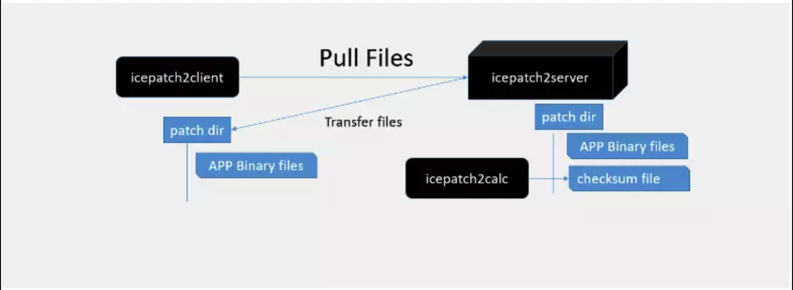

#集团门户通信中间件ICE选用说明
-
###导语：
ICE(Internet Communications Engine)是ZeroC提 供的一款高性能的中间件，基于ICE可以实现电信级的解决方案。前面我们提到过在设计网站架构的时候可以使用ICE实现对网站应用的基础对象操作，将基础 对象操作和数据库操作封装在这一层，在业务逻辑层以及表现层(java,php,.net,python, javascript,Object-c,Androuid)进行更丰富的表现与操作，从而实现比较好的架构。基于ICE的数据层可以在未来方便的进行扩展。ICE支持分布式的部署管理，消息中间件，以及网格计算等等。

###为什么选用ICE?
-
经过多方调研发现现在支持多语言的RPC框架无外乎就那么几款：<br/>
[thrift](http://thrift.apache.org):&nbsp;&nbsp;Thrift是一种接口描述语言和二进制通讯协议，它被用来定义和创建跨语言的服务。它被当作一个远程过程调用（RPC）框架来使用，是由Facebook为“大规模跨语言服务开发”而开发的。<br/>
[gRPC](https://grpc.io):&nbsp;&nbsp;是谷歌近年新推的一套 RPC 框架，基于 protobuf 的强契约编程模型，能自动生成各种语言客户端，且保证互操作。支持 HTTP2 是 gRPC 的一大亮点，通讯层性能比 HTTP 有很大改进。Protobuf 是在社区具有悠久历史和良好口碑的高性能序列化协议，加上 Google 公司的背书和社区影响力，目前 gRPC 也比较火，GitHub 上有超过 13.4k 星。
目前看 gRPC 更适合内部服务相互调用场景，对外暴露 RESTful 接口可以实现，但是比较麻烦（需要 gRPC Gateway 配合），所以对于对外暴露 API 场景可能还需要引入第二套 RESTful 框架作为补充。总体上 gRPC 这个东西还比较新，社区对于 HTTP2 带来的好处还未形成一致认同，建议谨慎投入，可以做一些试点。<br/>
[ICE](https://zeroc.com/):&nbsp;&nbsp;ZeroC IceGrid作为一种微服务架构，它基于RPC框架发展而来，具有良好的性能与分布式能力。不过尴尬的是在国内使用它的案例并不多，目前Skpye、宝信一些地方在使用Ice。不过这并不影响它的优点，那就是它的性能很不错，以下是源自网上的性能测试：<br>
<br/>
<br/>
如下所示是它的整体示意图：<br/>
<br>
####IceGrid具备微服务架构的如下明显特征：

微服务架构需要一个集中的服务注册中心，以及某种服务发现机制。IceGrid服务注册采用XML文件来定义，其服务注册中心就是Ice Registry，这是一个独立的进程，并且提供了HA高可用机制；对应的服务发现机制就是命名查询服务，即LocatorService提供的API，可以根据服务名查询对应的服务实例可用地址。


微服务架构中的每个微服务通常会被部署为一个独立的进程，当无状态服务时，一般会由多个独立进程提供服务。对应在IceGrid里，一个IceBox就是一个单独的进程，当一个IceBox只封装一个Servant时，就是一个典型的微服务进程了。


微服务架构中通常都需要内嵌某种负载均衡机制。在 IceGrid 里是通过客户端API内嵌的负载均衡算法实现的，相对于采用中间件Proxy转发流量的方式（如SpringCloud），IceGrid的做法更加高效，但增加了平台开发的工作量与难度，因为采用各种语言的客户端都需要实现一遍负载均衡的算法逻辑。


一个好的微服务架构平台应该简化和方便应用部署。我们看到 IceGrid提供了grid.xml来描述与定义一个基于微服务架构的Application，一个命令行工具一键部署这个Application，还提供了发布二进制程序的辅助工具——icepatch2。下图显示icepatch2的工作机制，icepatch2server类似于FTP Sever，用于存放要发布到每个Node上的二进制代码与配置文件，而位于每个Node上的icepatch2client则从icepatch2server上拉取文件，这个过程中采用了压缩传输及差量传输等高级特性，以减少不必要的文件传输过程。客观地评价，在Docker技术之前，icepatch2这套做法还是很先进与完备的，也大大减少了分布式集群下微服务系统的运维工作量。


####基于IceGrid的微服务方案
如果基于IceGrid开发系统，则通常有三种典型的技术方案，下图展示了这三种技术方案：


其中方案一是比较符合传统Java Web项目的一种渐进改造方案，Spring Boot里只有Controller组件而没有数据访问层与Service对象，这些Controller组件通过Ice RPC方式调用部署在IceGrid里的远程的Ice微服务，面向前端包装为REST服务。此方案的整体思路清晰，分工明确。Leader在开源项目中给出了这种方式的一个基本框架以供参考：[github.com/MyCATApache/mycat-ice](https://github.com/MyCATApache/mycat-ice)


方案二与方案三则比较适合前端JavaScript能力强的团队，比如很擅长Node.js的团队可以考虑方案二，即用JavaScript来替代Spring Boot实现REST服务。主要做互联网App的系统则可以考虑方案三，浏览器端的JavaScript以HTML5的WebSocket技术与Ice Glacier2直接通信，整体高效敏捷。


IceGrid在3.6版本之后还增加了容器化的运行方式，即Ice Node与Ice Registry可以通过Docker容器的方式启动，这就简化了IceGrid在Linux上的部署。对于用Java编写的Ice微服务架构系统，我们还可以借助Java远程类加载机制，让每台Node自动从某个远程HTTP Server下载指定的Jar包并加载相关的Servant类，从而实现类似Docker Hub的机制。下图显示了前面提到mycat-ice开源项目时给出的具体实现方案。


Ice运作原理
以下是一个简单运作流程图：


ICE 有着最简单的使用方式，如果只用Ice RPC，Java方面就只需要一个Jar包，PHP方面就一个.so或dll运行库很容易容易嵌入程序，没有复杂的第三方依赖。

相对HttpClient来说 采用 ICE 的高性能 RPC框架 开发相对更便捷。

###Ice多客户端调用
-
通过Java链接mysql数据库 并查询 数据库中 books表中的数据如下：


####Java使用

```
/*
 * This Java source file was generated by the Gradle 'init' task.
 */
package com.tlwl.demo.ice.main;

import com.tlwl.demo.base.BaseDBManager;

public class Server {
    public String getGreeting() {
        return "Hello world.";
    }

    public static void main(String[] args) {
        int status = 0;
        // InputStream inStream = Server.class.getClassLoader().getResourceAsStream("db.properties");  
        
        // System.out.println(inStream);
        // System.exit(status); 
        BaseDBManager.getDBManager().initDBPool();
        System.out.println("-->init druid pool success");

        

        //
        // Try with resources block - communicator is automatically destroyed
        // at the end of this try block
        //
        try (com.zeroc.Ice.Communicator communicator = com.zeroc.Ice.Util.initialize(args,"config.server")) {
            communicator.getProperties().setProperty("Ice.Default.Package", "com.tlwl.demo");

            //
            // Install shutdown hook to (also) destroy communicator during JVM shutdown.
            // This ensures the communicator gets destroyed when the user interrupts the
            // application with Ctrl-C.
            //
            String port = "18001";
            String adapterName = "TlwlAdapter";
            String objectName = "tlwladapter";
            
            for (int i = 0; i < args.length; i++) {
                if (args[i].equals("-p")) {
                    i++;
                    port = args[i];
                }
            }

            if (port.equals("18002")) {
                objectName = "tlwladapter1";
                adapterName = "TlwlAdapter1";
            } else if (port.equals("18003")) {
                objectName = "tlwladapter2";
                adapterName = "TlwlAdapter2";
            } else if (port.equals("18004")) {
                objectName = "tlwladapter3";
                adapterName = "TlwlAdapter3";
            } else if (port.equals("18005")) {
                objectName = "tlwladapter4";
                adapterName = "TlwlAdapter4";
            }

            com.zeroc.Ice.ObjectAdapter adapter = communicator.createObjectAdapter(adapterName);
            // com.zeroc.Ice.Object object = new RequestI();
            adapter.add(new RequestI(), com.zeroc.Ice.Util.stringToIdentity(objectName));

            adapter.activate();
            System.out.println("-->server start success with:"+port);
            communicator.waitForShutdown();
        }catch (Exception e) {
            System.out.println(e.toString());
        }

        System.exit(status);
    }
}
```


####PHP调用
```
<?php
require_once "Ice.php";
require_once "RequestI.php";

$ice = null;
try {
    $communicator = Ice\initialize();
    $base = $communicator->stringToProxy("tlwladapter:default -p 18001");
    // $request = RequestPrxHelper::checkedCast($base);
    $request = $base->ice_checkedCast('::IRequest::Request', null, null);
    if (!$request) {
        throw new RuntimeException("Invalid proxy"); 
    }
    $result_json=$request->setRequest("book_list","{id:2}");
    echo $result_json;
    $array=json_decode($result_json);
    echo "\r\n".str_repeat("---",40)."\r\n";
    echo "|\r\n|".str_repeat("\t",7)." The Book List \r\n|\r\n";
    foreach ($array->data as $val) {
        $str = str_repeat("---",40)."\r\n|id:\r\t{$val->id}\r\n|isbn:\t{$val->isbn}\r\n|title:\t{$val->title}\r\n";
        echo $str;
        // echo "\r\tisbn:{$val->isbn}\r\n";
        // echo "\r\ttitle:{$val->title}\r\n";
    }
    echo str_repeat("---",40);
    // var_dump($array->data);
} catch (Exception $ex) {
    echo "\n{$ex}\n";
}
if($ice){
    $ice->destroy();
}
```
```sh
php -f client.php

java response : {"code":0,"data":[{"isbn":"096447963X","id":1,"title":"The Dragon Style (Learn to Play Go, Volume III)"},{"isbn":"0964479613","id":2,"title":"Learn to Play Go: A Master\u0027s Guide to the Ultimate Game (Volume I)"},{"isbn":"0964479621","id":3,"title":"The Way of the Moving Horse (Learn to Play Go, Volume II)"},{"isbn":"0964479648","id":4,"title":"Battle Strategies (Learn to Play Go Series)"},{"isbn":"0201889544","id":5,"title":"The C++ Programming Language"},{"isbn":"0201543303","id":6,"title":"The Design and Evolution of C++"},{"isbn":"0201700735","id":7,"title":"The C++ Programming Language Special Edition"},{"isbn":"0201379260","id":8,"title":"The C++ Standard Library : A Tutorial and Reference"},{"isbn":"0201749629","id":9,"title":"Effective STL: 50 Specific Ways to Improve Your Use of the Standard Template Library"},{"isbn":"0201924889","id":10,"title":"Effective C++: 50 Specific Ways to Improve Your Programs and Design"},{"isbn":"020163371X","id":11,"title":"More Effective C++: 35 New Ways to Improve Your Programs and Designs"},{"isbn":"0201615622","id":12,"title":"Exceptional C++: 47 Engineering Puzzles, Programming Problems, and Solutions"},{"isbn":"020170434X","id":13,"title":"More Exceptional C++"},{"isbn":"0201704315","id":14,"title":"Modern C++ Design: Generic Programming and Design Patterns Applied"},{"isbn":"0735616353","id":15,"title":"Microsoft Visual C++ .NET Deluxe Learning Edition"},{"isbn":"0735615497","id":16,"title":"Programming with Microsoft Visual C++ .NET, Sixth Edition (Core Reference)"},{"isbn":"0735614229","id":17,"title":"Applied Microsoft .NET Framework Programming"},{"isbn":"0201824701","id":18,"title":"C++ Primer"},{"isbn":"0201485184","id":19,"title":"Essential C++"},{"isbn":"020170353X","id":20,"title":"Accelerated C++: Practical Programming by Example"},{"isbn":"0201423391","id":21,"title":"Ruminations on C++ : A Decade of Programming Insight and Experience"},{"isbn":"0201179288","id":22,"title":"C Traps and Pitfalls"},{"isbn":"0131103628","id":23,"title":"The C Programming Language"},{"isbn":"020161586X","id":24,"title":"The Practice of Programming"},{"isbn":"013937681X","id":25,"title":"UNIX Programming Environment, The"},{"isbn":"0201563177","id":26,"title":"Advanced Programming in the UNIX(R) Environment"},{"isbn":"0201633469","id":27,"title":"The Protocols (TCP/IP Illustrated, Volume 1)"},{"isbn":"0201634953","id":28,"title":"TCP for Transactions, HTTP, NNTP, and the UNIX(R) Domain Protocols (TCP/IP Illustrated, Volume 3)"},{"isbn":"013490012X","id":29,"title":"UNIX Network Programming, Volume 1: Networking APIs - Sockets and XTI"},{"isbn":"0130810819","id":30,"title":"UNIX Network Programming: Interprocess Communications"}]}
```


### 示例源码
[tian-wolf/zeorc-ice-demo](https://github.com/tian-wolf/zeorc-ice-demo.git)